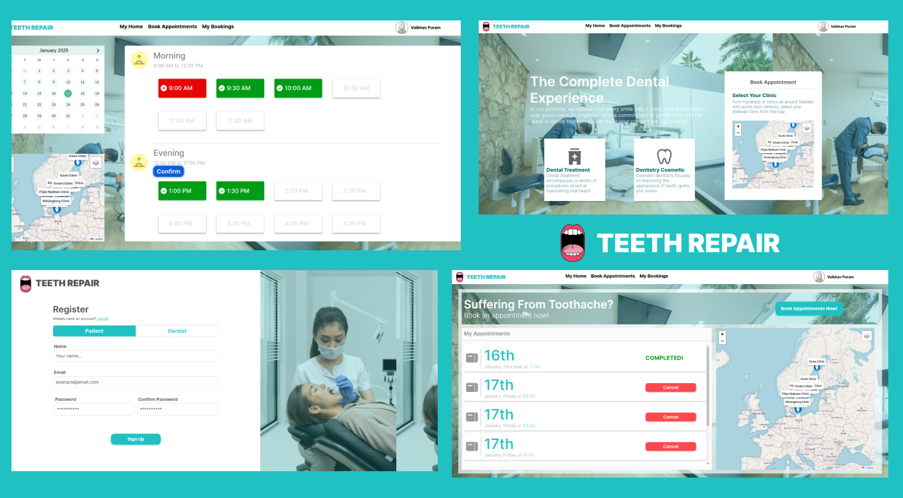

    

## Table of Content 

[[_TOC_]] 

    

## Introduction

**TeethRepair** is a **full-stack** dentist booking system all across Sweden. It allows both patients and dentists to streamline their appointment booking process while offering an intuitive user experience.  The system provide core functionalites such as booking appointments, managing appointment availability, viewing clinics on a map, and staying notified about booking updates.

## Tech Stack

### Frontend

- [Vue.js](https://vuejs.org/) (Frontend framework)

- [BootstrapVue](https://bootstrap-vue.org/) (Library for building responsive frontend)

- [Leaflet](https://leafletjs.com/) (Libray for the Map)

- [Node Package Manager](https://www.npmjs.com/) (Package Manager)

- [Eclipse Paho](https://github.com/eclipse-paho/paho.mqtt.java) (MQTT Library)

### Backend

- [Maven](https://maven.apache.org/) (Automated Build and Dependency Management Tool)

- [Spring Boot](https://spring.io/projects/spring-boot) (Building Java-based standalone project tool)

- [MongoDB Atlas](https://github.com/mongodb/mongodb-atlas-cli) (Service database)

- [Eclipse Paho](https://projects.eclipse.org/projects/iot.paho)(MQTT Library)

## Installation Guide

Please follow the installation guide to set up the project.

Before setting up either of the installations, please clone the project.

~~~ 
git clone git@git.chalmers.se:courses/dit355/2024/student_teams/dit356_2024_20/dit-356-project-group-20.git 
~~~

### Setting up the Services

1) Make sure you are in the root directory in the command line

2) Through the bash command line, write the following command

~~~
docker swarm init
docker login
~~~

3) After this, you will be prompted to login to the container registry to pull images from our repository's container registry.

4) After succesfully logging in, run the following command.

In Linux,

~~~
bash automated_build.sh
~~~

In Windows, make sure you run this through **Git Bash**,

~~~
chmod +x automated_build.sh
./automated_build.sh
~~~

5) You have succesfully run the services! If you decide to close the services please run the following command.

~~~
docker stack rm microservices_stack
docker stop $(docker ps -q)
~~~

### Setting up the Application 

2) Install client dependencies

~~~
cd client
npm install
~~~

3) Run the application

~~~
npm run dev
~~~

## System's Architecture

The system relies on the combination between **microservices and publish-subscribe**. It creates a **distributed systems** environment where several services can run independently from each other through different nodes. 

Entity Relationship (ER) Diagram

Architecture Diagram

Deployment Diagram

## Development Process

At the start of the project, we devised a **Social Contract** that would explain the decision-making, processes we use, communication channels and which days we are off. The Social Contract can be found in the **Wiki**.

The team followed a lightweight **SCRUM** Process. It would consist of two meetings a week, a Sprint Planning and a Sprint Review

In the **Sprint Planning**, we discuss the current backlog, and select tasks to distribute to the members.

In the **Sprint Review**, the team would showcase and review each others  tasks and have a constructive feedback session about the team's dynamic.

During the week, members would use the **Issue Board** to track their issues between Open, In-Progress, and Closed as well as open additional code meetings if the members need help or are pair-programming.

## Contributors

|  Name  | username |
| ------ | ---------|
|    Mohamed Taha Jasser    |   @mohamedt        |
|    Nadman Abdullah Bin Faisal    |    @nadman      |
|    Vaibhav Puram    |   @puram       |
|    Danis Music    |    @danism      |
|    Filipe Rosa    |    @filipero      |

## Acknowledgments

Many thanks to the contributors of the project for helping out finishing the project.

And many thanks to the professors and the TAs of Gothenburg University|Chalmers University for providing the necessary knowledge and insights for the development of this project.